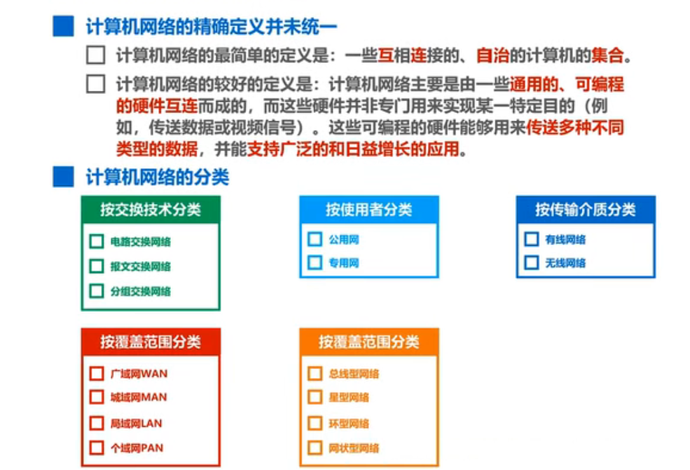
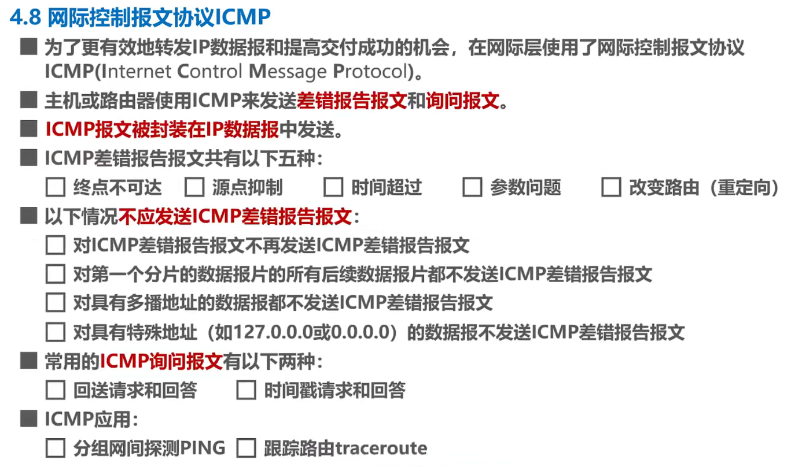

# Computer-Network
[Crash Course](https://www.bilibili.com/video/BV1c4411d7jb?p=9)  
[practice](https://mooc1.chaoxing.com/mycourse/studentstudy?chapterId=514468890&courseId=222640205&clazzid=50594404&cpi=242880082&enc=731c7d0116ea42bde24fb801ab046f4f&mooc2=1&openc=e1fdab8fd7617963e289fb338aa720d2)  

## commit format
Subject = concise summary of what happened 

Body = more detailed explanation:
1. What is now different than before? 
2. What's the reason for the change? 
3. Is there anything to watch out for / anything particularly remarkable? 

**Table of Contents**
- [**chapter 1 Overview**](#chapter-1)
  1. [Three switching methods](#13-three-switching-methods-circuit-switching-packet-switching-and-message-switching)
  2. [Definition and Classification of Computer Networks ](#14-definition-and-classification-of-computer-networks)
  3. [Performance indicators of computer networks](#15-performance-indicators-of-computer-networks)
  4. [Computer Network Architecture](#16-computer-network-architecture)
- [**chapter 2 The Physical Layer**](#chapter-2)
  1. [The basic concept of the physical layer](#21-the-basic-concept-of-the-physical-layer)
  2. [The transport media below the physical layer](#22-the-transport-media-below-the-physical-layer)
  3. [Transmission mode](#23-transmission-mode)
  4. [Encoding and modulation](#24-encoding-and-modulation)
  5. [The limit capacity of the channel](#25-the-limit-capacity-of-the-channel)
- [**chapter 3 Data Link Layer**](#chapter-3)
  1. [Data link layer overview](#31-data-link-layer-overview)
  2. [Encapsulated into frames](#32-encapsulated-into-frames)
  3. [Error detection](#33-error-detection)
  4. [Reliable transmission](#34-reliable-transmission)
  5. [Peer-to-peer protocol PPP](#35-peer-to-peer-protocol-ppp)
  6. [Media Access Control MAC](#36-media-access-control-mac)
  7. [MAC address, IP address and ARP protocol](#37-mac-address-ip-address-and-arp-protocol)
  8. [The difference between a hub and a switch](#38-the-difference-between-a-hub-and-a-switch)
  9. [The Ethernet switch learns itself and forwards the flow of frames](#39-the-Ethernet-switch-learns-itself-and-forwards-the-flow-of-frames1)
  10. [Spanning Tree Protocol STP for Ethernet Switches](#310-spanning-tree-protocol-stp-for-ethernet-switches)
  11. [Virtual Local Area Network (VLAN) VLANs](#311-virtual-local-area-network-vlan-vlans)
- [**Chapter 4 The Network Layer**](#chapter-4-the-network-layer)
  1. [Network layer overview](#41-network-layer-overview)
  2. [The network layer provides two services ](#42-1the-network-layer-provides-two-services)
  3. [IPv4 addresses and their applications](#43-ipv4-addresses-and-their-applications)
  4. [The process of sending and forwarding IP datagrams](#44-the-process-of-sending-and-forwarding-ip-datagrams)
  5. [Static route configuration and routing loop problems that it can generate](#45-2static-route-configuration-and-routing-loop-problems-that-it-can-generate)
  6. [Routing Protocol](#46-routing-protocol)
  7. [The first format of the IPv4 datagram](#47-the-first-format-of-the-ipv4-datagram)
  8. [Internet control message protocol ICMP](#48-internet-control-message-protocol-icmp)
  9. [Virtual Private Network VPN with Network Address Translation NAT](#49-virtual-private-network-vpn-with-network-address-translation-nat)
  10. [Software-Defined Networking SDN](#410-software-defined-networking-sdn)
----------
# Chapter 1 Overview 
## 1.3 Three switching methods: circuit switching, packet switching and message switching 

## 1.4 Definition and Classification of Computer Networks 

topological structure

## 1.5 Performance indicators of computer networks 
- ### 1.5.1 Rate, bandwidth, throughput, latency 
    
- ### 1.5.2 Latency bandwidth product, round-trip time, utilization, packet loss rate 
    
If the propagation delay of a link is 20ms and the bandwidth is 20Mbit/s, then the delay bandwidth product of the link is  
    A.200000bit  
    B.400000bit  
    C.100000bit  
    D.800000bit  

solution:  
&nbsp;&nbsp;&nbsp;&nbsp;20ms = 0.02sec
&nbsp;&nbsp;&nbsp;&nbsp;0.02sec * 20Mbit/s = 0.02 * 20 * 1,000,000 = **400,000**bit
## 1.6 Computer Network Architecture 
- ### 1.6.1 Common computer network architectures 
    
- ### 1.6.2 Necessity of Layering
     
- ### 1.6.3 Examples of hierarchical thinking 
    
- ### 1.6.4 Terminology 
    
## 1.8

## Chapter Summary
Watch the Xmind of chapter 1
------------
#  Chapter 2 The Physical Layer
- ## 2.1 The basic concept of the physical layer
    
- ## 2.2 The transport media below the physical layer
    
- ## 2.3 Transmission mode
    
- ## 2.4 Encoding and modulation
    
- ## 2.5 The limit capacity of the channel
    
- ## 2.6 Chapter Summary
Watch the Xmind of chapter 2
---------
# Chapter 3 Data Link Layer
## 3.1 Data link layer overview

## 3.2 Encapsulated into frames

## 3.3 Error detection

  
The following features of parity check codes are (A)
A.Only odd bits can be checked for error   
B.Only an even number of bit errors can be detected  
C.It can detect any number of bit errors  
D.The missed detection rate is lower than CRC
##  3.4 Reliable transmission
- ### 3.4.1 Basic concepts of reliable transmission
    
- ### 3.4.2 Implementation mechanism for reliable transmission —stop-wait protocol
    
Host A uses the stop wait protocol to send data to host B. the data transmission rate is 6 K/bps, and the one-way propagation delay is 100ms. The transmission delay of the confirmation frame is ignored. When the channel utilization is equal to 40%, the length of the data frame is  
A. 240 bits  
B. 320 bits
C. 600 bits
D. 800 bits  

- ### 3.4.3 Implementation mechanism for reliable transmission—back-to-back N-frame protocol
    
The data link layer adopts the back-off N frame protocol GBN, and the frame number is composed of 7 bits, so the maximum length of the transmission window is   
A. 7    
B. 8 
C. 127 
D. 128  
>Answer analysis:   
>In GBN, the size range of the sending window WT is 1 < WT ≤ 2n- 1, where n is the number of bits that make up the frame number, the title gives n = 7, obviously the maximum value of WT is 127.
- ### 3.4.4 Implementation Mechanism for Reliable Transport — Select the retransmission protocol
      

Which of the following protocols can only receive packets in order

I. stop - wait for protocol   
II Fallback N-frame protocol   
III. select retransmission protocol  

A. I、II  
B. I、III  
C. II、III  
D. whole
>Answer analysis:  
>The receiving window size of the stop wait protocol and the fallback N-frame protocol is 1, so only packets can be received in sequence. The receiving window size of the selected retransmission protocol is larger than 1, so a certain number of packets that do not arrive in order can be temporarily stored.
## 3.5 Peer-to-peer protocol PPP

The role of LCP frames in PPP is (A)  

A. Negotiate the configuration options for the data link protocol during the "establish" status phase  
B. Configure network layer protocols  
C. Check the data link layer for errors and notify the error message  
D. Security control to protect the data security of both communication parties  
## 3.6 Media Access Control MAC
- ### 3.6.1 Basic Concepts of Media Access Control
- ### 3.6.2 Media Access Control — Statically Dividing Channels
    
- ### 3.6.3 Media Access Control — Dynamic Access Control — Random Access — CSMA/CD protocol
    

In the CSMA/CD agreement, "contention period" refers to  

A. Time the signal is transmitted back and forth between the farthest two endpoints  
B. Time of signal transmission from one end of the line to the other  
C. Time from sending to receiving the reply  
D. Time from sending to receiving the response  
> A

CSMA/CD Ethernet with length of 10km and data transmission rate of 10mb/s and signal propagation rate of 200m/μs。 Then the minimum frame length of the network is  

A. 20bit  
B. 200bit  
C. 100bit  
D. 1000bit
> 
- ### 3.6.4 Media Access Control — Dynamic Access Control — Random Access — CSMA/CA protocol
    
## 3.7 MAC address, IP address and ARP protocol
- ### 3.7.1 MAC address
    
- ### 3.7.2 IP Address
    
- ### 3.7.3 ARP Protocol
    
## 3.8 The difference between a hub and a switch

## 3.9 The Ethernet switch learns itself and forwards the flow of frames

## 3.10 Spanning Tree Protocol STP for Ethernet Switches

## 3.11 Virtual Local Area Network (VLAN) VLANs
- ### 3.11.1 Virtual Local Area Network (VLAN) VLANs Overview
    
- ### 3.11.2 Implementation Mechanism of Virtual Local Area Network VLANs
      
--------------
# Chapter 4 The Network Layer 
## 4.1 Network layer overview 

## 4.2 The network layer provides two services 

## 4.3 IPv4 addresses and their applications 
- ### 4.3.1 Overview of IPv4 Addresses 
    
- ### 4.3.2 IPv4 addresses for classified addressing 
    
- ### 4.3.3 Subnetting IPv4 addresses 
    
- ### 4.3.4 IPv4 addresses without classified addressing 
    
- ### 4.3.5 Application planning for IPv4 addresses 
    
In order to reduce address waste on a point-to-point link, the address mask should be specified as   

A. 255.255.255.252  
B. 255.255.255.248  
C. 255.255.255.240  
D. 255.255.255.196

> C

In the following statement about FLSM and VLSM, the error is  

A. FLSM uses the same subnet mask to partition subnets  
B. VLSM can use different subnet masks to partition subnets  
C. Use the subnet divided by FLSM, and the number of IP addresses allocated to each subnet is the same  
D. Using VLSM to divide subnets, only an even number of subnets can be divided  

> D
## 4.4 The process of sending and forwarding IP datagrams 

## 4.5 Static route configuration and routing loop problems that it can generate  

If the network where the destination IP address of an IP packet resides has A routing loop, then 

A. IP packet will circle permanently in the network.   
B. IP packet can finally reach the destination host.  
C. IP packet will circle A limited number of times in the networks  
D. IP datagrams do not go around the network  

> C

When configuring A default route for A router, the destination network address and subnet mask are 

A. 0.0.0.0 0.0.0.0   
B. 0.0.0.0 255.255.255.255   
C. 255.255.255.255 0.0.0.0   
D. 255.255.255.255 255.255.255.255

> A
## 4.6 Routing Protocol 
- ### 4.6.1 Routing Protocol Overview 
    
- ### 4.6.2 The basic working principle of the routing information protocol RIP 
    
- ### 4.6.3 The basic working principle of open shortest path first OSPF 
    
- ### 4.6.4 The Basic Working Principles of Border Gateway Protocol BGP 
    
## 4.7 The first format of the IPv4 datagram 

## 4.8 Internet control message protocol ICMP 
  
 If A router receives an IP packet with the TTL value of 1,   
 
 A. forwards the IP packet. 
 B. discards the IP packet only.  
 C. discards the IP packet and sends an ICMP error report packet  
 D. with the destination unreachable type to the source host that sends the IP packet Discards the IP packet and sends an ICMP error report packet of the expired type to the source host that sends the IP packet  
## 4.9 Virtual Private Network VPN with Network Address Translation NAT 

## 4.10 Software-Defined Networking SDN 
## 4.11 Extended Learning Video: Internet: Packets, Routing, and Reliability 
# Chapter 5 Transport Layer 
## 5.1 Transport layer overview 
## 5.2 The concept of transport layer port numbers, multiplexing, and separation 
## 5.3 Comparison of UDP and TCP 
## 5.4 TCP traffic control 
## 5.5 Congestion control of TCP 
## 5.6 TCP timeout retransmission time selection 
## 5.7 Implementation of tcp reliable transport 
## 5.8 Transport Connection Management for TCP 
- ### 5.8.1 TCP connection establishment 
- ### 5.8.2 TCP connection release 
## 5.9 The format of the first part of the TCP message segment

