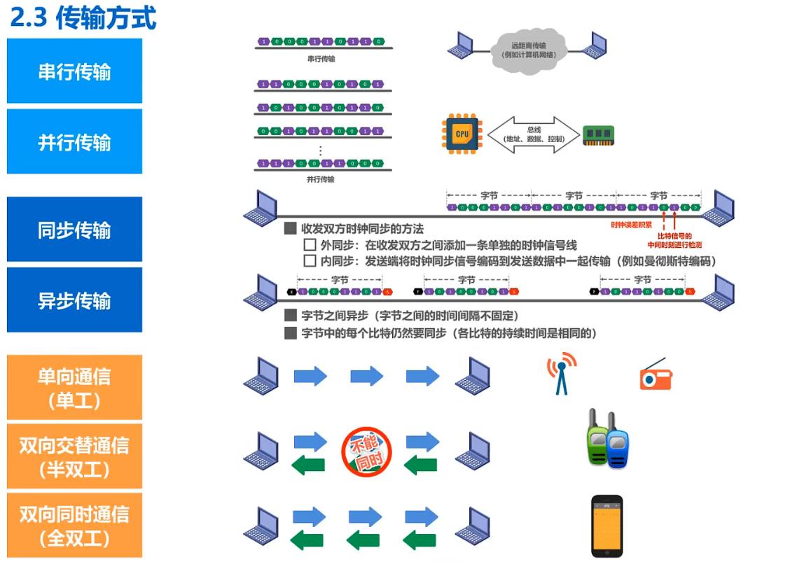
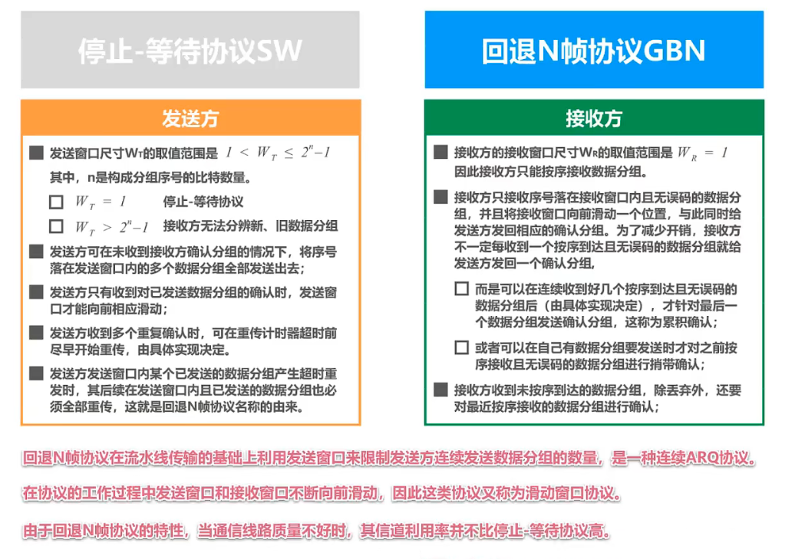

# Computer-Network
[Crash Course](https://www.bilibili.com/video/BV1c4411d7jb?p=9)  
[practice](https://mooc1.chaoxing.com/mycourse/studentstudy?chapterId=514468890&courseId=222640205&clazzid=50594404&cpi=242880082&enc=731c7d0116ea42bde24fb801ab046f4f&mooc2=1&openc=e1fdab8fd7617963e289fb338aa720d2)  
**Table of Contents**
- [chapter 1 Overview](#chapter-1)
  1. [Three switching methods](#13-three-switching-methods-circuit-switching-packet-switching-and-message-switching)
  2. [Definition and Classification of Computer Networks ](#14-definition-and-classification-of-computer-networks)
  3. [Performance indicators of computer networks](#15-performance-indicators-of-computer-networks)
  4. [Computer Network Architecture](#16-computer-network-architecture)
- [chapter 2 The Physical Layer](#chapter-2)
  1. [The basic concept of the physical layer](#21-the-basic-concept-of-the-physical-layer)
  2. [The transport media below the physical layer](#22-the-transport-media-below-the-physical-layer)
  3. [Transmission mode](#23-transmission-mode)
  4. [Encoding and modulation](#24-encoding-and-modulation)
  5. [The limit capacity of the channel](#25-the-limit-capacity-of-the-channel)
- [chapter 3](#chapter-3)
----------
# Chapter 1 Overview 
## 1.3 Three switching methods: circuit switching, packet switching and message switching 

## 1.4 Definition and Classification of Computer Networks 

topological structure

## 1.5 Performance indicators of computer networks 
- ### 1.5.1 Rate, bandwidth, throughput, latency 
    
- ### 1.5.2 Latency bandwidth product, round-trip time, utilization, packet loss rate 
    
If the propagation delay of a link is 20ms and the bandwidth is 20Mbit/s, then the delay bandwidth product of the link is  
    A.200000bit  
    B.400000bit  
    C.100000bit  
    D.800000bit  

solution:  
&nbsp;&nbsp;&nbsp;&nbsp;20ms = 0.02sec
&nbsp;&nbsp;&nbsp;&nbsp;0.02sec * 20Mbit/s = 0.02 * 20 * 1,000,000 = **400,000**bit
## 1.6 Computer Network Architecture 
- ### 1.6.1 Common computer network architectures 
    
- ### 1.6.2 Necessity of Layering
     
- ### 1.6.3 Examples of hierarchical thinking 
    
- ### 1.6.4 Terminology 
    
## 1.8

## Chapter Summary
Watch the Xmind of chapter 1
------------
#  Chapter 2 The Physical Layer
- ## 2.1 The basic concept of the physical layer
    
- ## 2.2 The transport media below the physical layer
    
- ## 2.3 Transmission mode
    
- ## 2.4 Encoding and modulation
    
- ## 2.5 The limit capacity of the channel
    
- ## 2.6 Chapter Summary
Watch the Xmind of chapter 2
---------
# Chapter 3 Data Link Layer
## 3.1 Data link layer overview

## 3.2 Encapsulated into frames
##  3.3 Error detection

##  3.4 Reliable transmission
- ### 3.4.1 Basic concepts of reliable transmission
    
- ### 3.4.2 Implementation mechanism for reliable transmission —stop-wait protocol
    
- ### 3.4.3 Implementation mechanism for reliable transmission—back-to-back N-frame protocol
    
- ### 3.4.4 Implementation Mechanism for Reliable Transport — Select the retransmission protocol
    
## 3.5 Peer-to-peer protocol PPP

## 3.6 Media Access Control MAC
- ### 3.6.1 Basic Concepts of Media Access Control
- ### 3.6.2 Media Access Control — Statically Dividing Channels
    
- ### 3.6.3 Media Access Control — Dynamic Access Control — Random Access — CSMA/CD protocol
    
- ### 3.6.4 Media Access Control — Dynamic Access Control — Random Access — CSMA/CA protocol
    
## 3.7 MAC address, IP address and ARP protocol
- ### 3.7.1 MAC address
- ### 3.7.2 IP Address
- ### 3.7.3 ARP Protocol
## 3.8 The difference between a hub and a switch
## 3.9 The Ethernet switch learns itself and forwards the flow of frames
## 3.10 Spanning Tree Protocol STP for Ethernet Switches
## 3.11 Virtual Local Area Network (VLAN) VLANs
- ### 3.11.1 Virtual Local Area Network (VLAN) VLANs Overview
- ### 3.11.2 Implementation Mechanism of Virtual Local Area Network VLANs

